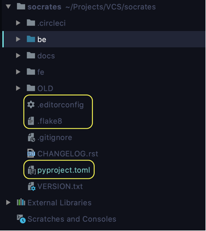
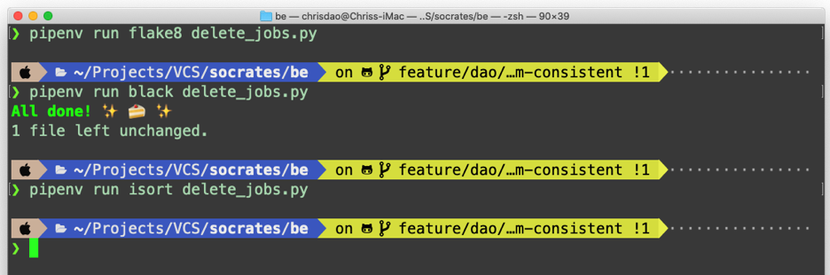
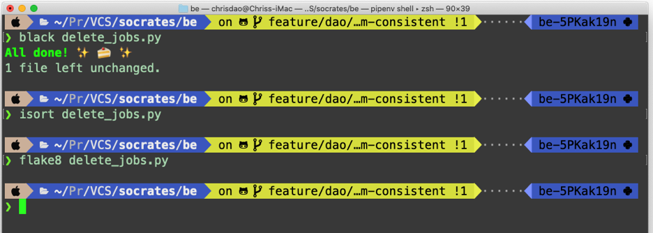

# Code Formatter Guide-line
**Basic configuration files for any project**

Consistency coding by just a few commands
In any projects, it is believed that developers usually suffered from un-consistent code. 
To reduce that, in our project directory, 
we should have files that would do the job to help our code be more consistent with other developers. 
This might be our standard for future projects, I hope.

In your root directory, there should have 3 files: “.editorconfig”, “pyproject.toml”, “.flake8”.

`.editorconfig`: this file is used for the editor to read, 
and override the editor’s default config into those configurations in this file.

`pyproject.toml`: this file is used for configuring tools like Isort, Black, and many many others

`.flake8`: this file is used for configuring the Flake8 package.

**All these files should lay in your top directory of your repo.**



_In these config files. We agree with Black code formatting with only 1 exception: max line length increase to 100._

## What is Isort, Black, Flake8?
**Isort**: 
sort imports alphabetically, and automatically separated into sections and by type.
- Reference: https://pypi.org/project/isort/

**Black**: the uncompromising Python code formatter. 
Black gives you speed, determinism, and freedom from pycodestyle nagging about formatting. 
Blackened code looks the same regardless of the project you're reading. 
Formatting becomes transparent after a while and you can focus on the content instead.
- Reference: https://black.readthedocs.io/en/latest/

**Flake8**: a Python library that wraps PyFlakes, pycodestyle and Ned Batchelder's McCabe script. 
It is a great toolkit for checking your code base against coding style (PEP8), programming errors 
(like “library imported but unused” and “Undefined name”) and to check cyclomatic complexity.
- Reference: https://pypi.org/project/flake8/

## Why Flake8 configurations lie outside “pyproject.toml”?
- Because the current Flake8 still does not support the .toml format.
- Maybe in the near future, we can put Flake8 configurations into pyproject.toml.

## How to use these modules?
- If you are using pipenv and not in the virtual environment. Simply type in: 
```zsh
pipenv run <module-name> <path-to-file>
```



- If you are already in the virtual environment:
```zsh
<module-name> <path-to-file>
```

